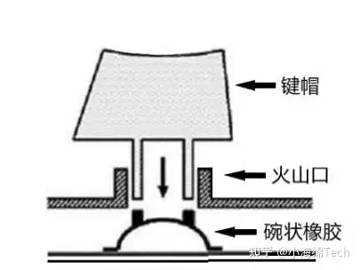
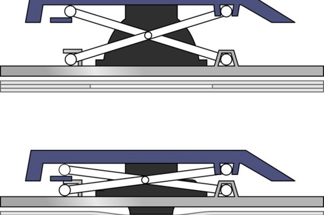
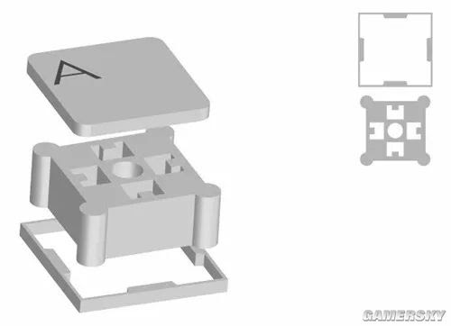

# **外设**

外设通常指计算机外围的各种输入输出设备，最基本的包括键盘、鼠标、音响、耳机等，这部分基于作者的有限了解来简单介绍一些常用的外设

## 键盘

着重介绍部分**常见**的键盘类型，在此之前需补充一些键盘相关的概念

#### **相关概念**

* 键程：按下一个按键后其所行进的路程
* 触发压力：按下按键使其触发所需要的压力大小
* 键位冲突：同时按下多个按键而只能成功输入其中的一个或部分

#### *薄膜键盘*

1.触发原理：按压按键使导电触点与电路板接触从而导通电路

2.常见结构

* 火山口型
  
  最常见的类型，成本低，寿命短（理论500万次），手感差且不均匀
* 剪刀脚型
  
  较高端的类型，成本更高，寿命更长，手感更好且更均匀，多用于笔记本键盘，灰尘容易进入间隙且难以清理
* 宫柱型
  
  最高端的类型，成本最高，使用高硬度材料制成宫柱（中间部分），改进了核心部件磨损问题，寿命更长，手感最好且灰尘不易进入
  3.突出优点

* 性价比高：价格通常低于其他类型的键盘
* 轻便实用：能满足大部分普通输入需求，且产品大多轻薄便携

4.主要不足

* 手感单一，很难满足个性化需要
* 核心部件易老化，理论使用寿命短（远低于理论寿命，一般为1~3年）
* 输入时存在键位冲突

#### *传统机械键盘*

#### *静电容键盘*

#### *光轴键盘*

#### *磁轴键盘*

#### *电感轴键盘*

## 鼠标

## 耳机

## 其他输入设备

#### *数位板*

#### *扫描仪*

## 其他输出设备

#### *打印机*

#### *传真机*
